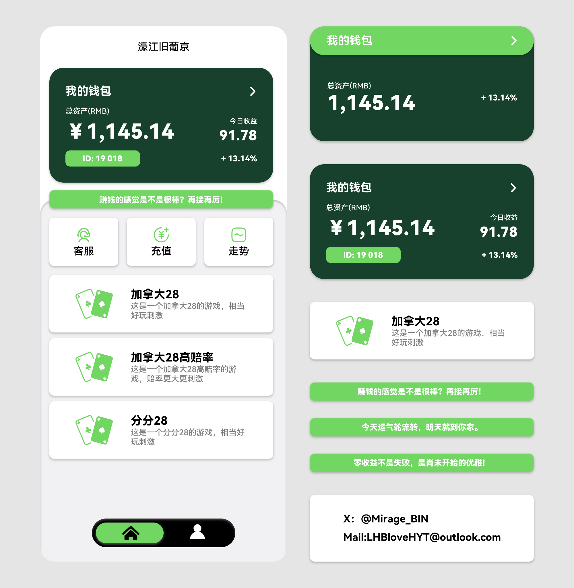

# 高端PC/PGH5前端UI

**精心打磨的博弈平台界面，专为提升用户粘性与充值转化率而设计。**

---

## 预览

  

> 首页 · 个人中心 · 在线客服 —— 覆盖核心操作链路

---

## 设计亮点

| 模块 | 设计策略 |
|------|----------|
| **钱包卡片** | 深色渐变 + 绿色点缀，凸显资产安全感，今日收益实时可见，刺激复投欲望 |
| **充值与走势** | 首屏黄金位置独立入口，缩短充值路径，走势数据培养"下一把"心理 |
| **游戏列表** | 高赔率标签 + 紧迫感文案，多层级产品线覆盖不同风险偏好玩家 |
| **在线客服** | 猜你想问智能推荐，减少客服压力同时降低玩家流失 |
| **底部导航** | 绿色高亮当前页，胶囊式设计触感友好，核心页面2步可达 |

> 每一处交互都经过转化漏斗推敲，力求让玩家 **进来就想充，充了还想玩**。

---

## 售价

| 内容 | 价格 |
|------|------|
| 图标素材 | **¥50** |
| UI / UX 设计稿 | **¥200** |
| 前端完整代码（HTML/CSS/JS 单文件） | **¥500** |

---

## 获取方式

- 源文件及设计稿请联系面谈，不接受无偿索要
- X:@Mirage_BIN
- Mail:LHBloveHYT@outlook.com

---

*本仓库仅展示前端效果，完整项目需付费获取。*
